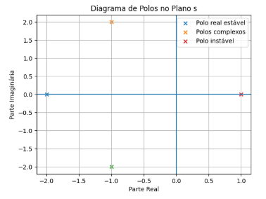
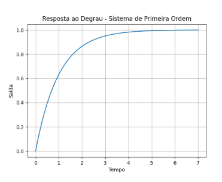
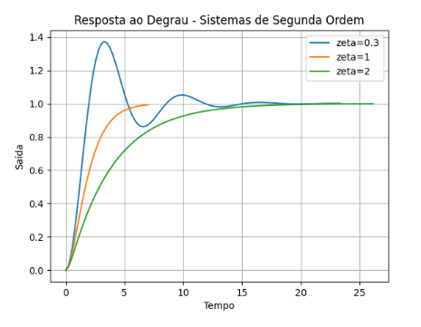

# Fundamentos de Sistemas Dinâmicos

## 1. Introdução

A análise e o projeto de sistemas de controle exigem uma compreensão profunda de como os sistemas dinâmicos se comportam ao longo do tempo. O estudo desses sistemas visa desenvolver a capacidade de compreender e modelar matematicamente o comportamento de sistemas físicos reais, estabelecendo uma conexão direta entre a teoria matemática e a prática na engenharia. Uma das abordagens clássicas para esse estudo, conhecida como técnica do domínio da frequência, baseia-se na conversão de equações diferenciais (que descrevem o sistema físico) em equações algébricas chamadas de funções de transferência.

---

## 2. Função de Transferência

A função de transferência é um modelo matemático que relaciona algebricamente a saída do sistema com a sua entrada. Ao substituir as equações diferenciais complexas que governam a dinâmica de um sistema por uma equação algébrica no domínio de Laplace (frequência complexa (s)), o processo de modelagem e interconexão de subsistemas é drasticamente simplificado.

Matematicamente, se um sistema tem entrada R(s) e saída C(s), então:

```
G(s) = C(s) / R(s)
```

A resposta total de saída de um sistema é composta por:

* Resposta forçada (devida à entrada)
* Resposta natural (devida às características internas do sistema)

---

## 3. Polos, Zeros e Representação Gráfica

Para evitar o cálculo da transformada inversa de Laplace, utiliza-se a análise por polos e zeros.

### Polos

São os valores de (s) que anulam o denominador da função de transferência. Determinam a forma da resposta natural do sistema.

### Zeros

São os valores de (s) que anulam o numerador. Afetam a amplitude da resposta, mas não sua natureza fundamental.

### Representação no Plano Complexo (Plano s)

Os polos e zeros são representados no plano complexo:

* Eixo real: (σ)
* Eixo imaginário: (jω)

Convenções:

* Polos → "x"
* Zeros → "o"

A posição dos polos determina diretamente a velocidade e o comportamento da resposta transitória.

---

## 4. Estabilidade e Resposta Temporal

A estabilidade de um sistema LTI depende da posição dos polos:

* Parte real negativa → sistema estável
* Parte real positiva → sistema instável

### Sistemas de Primeira Ordem

Apresentam um único polo real.

Função típica:

```
G(s) = K / (τs + 1)
```

A resposta temporal é exponencial:

```
y(t) ~ e^(−t/τ)
```

O principal parâmetro é a constante de tempo:

```
τ = a1
```

* Define o tempo para atingir ~63% do valor final
* Polos mais à esquerda → resposta mais rápida

---

### Sistemas de Segunda Ordem

Dependem de dois parâmetros:

* Frequência natural ωn
* Fator de amortecimento (ζ)

Forma geral:

```
G(s) = (ωn²) / (s² + 2*ζ*ωn*s + ωn²)
```

Tipos de resposta:

* Superamortecido (ζ > 1) → lento, sem oscilações
* Criticamente amortecido (ζ = 1) → mais rápido sem overshoot
* Subamortecido (0 < ζ < 1) → oscilatório
* Não amortecido (ζ = 0) → oscilação contínua

---

## 5. Representações Gráficas e Simulação

Para melhor compreensão dos fenômenos, foram analisadas representações gráficas e simulações.

### Plano s (Polos)

* Polos em s = -2 → resposta rápida e estável
* Polos em s = −1 ± j2 → resposta oscilatória
* Polos em s = +1 → sistema instável

Diagrama de polos no plano complexo.



Na figura acima, podemos observar que os polos localizados no semiplano esquerdo σ < 0 resultam em sistemas estáveis, enquanto polos no semiplano direito σ > 0 indicam instabilidade. Polos complexos conjugados introduzem comportamento oscilatório, evidenciando a influência da parte imaginária na dinâmica do sistema.

Abaixo, temos o código gerador da figura:

```python
import matplotlib.pyplot as plt

# Polos
p1 = -2
p2 = -1 + 2j
p3 = -1 - 2j
p4 = 1

plt.scatter(p1.real, p1.imag, marker='x', label='Polo real estável')
plt.scatter(p2.real, p2.imag, marker='x', label='Polos complexos')
plt.scatter(p3.real, p3.imag, marker='x')
plt.scatter(p4.real, p4.imag, marker='x', label='Polo instável')

plt.axhline(0)
plt.axvline(0)

plt.xlabel("Parte Real")
plt.ylabel("Parte Imaginária")
plt.title("Diagrama de Polos no Plano s")
plt.legend()
plt.grid()

plt.show()
```

---

### Sistema de 1ª Ordem

Resposta ao degrau de um sistema de primeira ordem.



A resposta apresenta comportamento exponencial crescente até o regime permanente. A constante de tempo pode ser observada como o instante em que a resposta atinge aproximadamente 63% do valor final, evidenciando a relação direta entre o polo do sistema e a velocidade da resposta.

Código referente à figura abaixo:

```python
import numpy as np
import matplotlib.pyplot as plt
from scipy import signal

system = signal.TransferFunction([1], [1, 1])
t, y = signal.step(system)

plt.plot(t, y)

plt.xlabel("Tempo")
plt.ylabel("Saída")
plt.title("Resposta ao Degrau - Sistema de Primeira Ordem")

plt.grid()
plt.show()
```

---

### Sistema de 2ª Ordem

Resposta ao degrau para diferentes fatores de amortecimento.



Observa-se que o fator de amortecimento ζ influencia diretamente o comportamento do sistema. Para ζ < 1, a resposta apresenta oscilações com overshoot, caracterizando um sistema subamortecido. Para ζ = 1, obtém-se a resposta criticamente amortecida, sendo a mais rápida sem ultrapassagem. Já para ζ > 1, o sistema torna-se superamortecido, apresentando resposta mais lenta e sem oscilações.

Código referente à figura:

```python
import numpy as np
import matplotlib.pyplot as plt
from scipy import signal

def sistema(zeta):
    wn = 1
    num = [wn**2]
    den = [1, 2*zeta*wn, wn**2]
    return signal.TransferFunction(num, den)

zetas = [0.3, 1, 2]

for z in zetas:
    system = sistema(z)
    t, y = signal.step(system)
    plt.plot(t, y, label=f'zeta={z}')

plt.xlabel("Tempo")
plt.ylabel("Saída")
plt.title("Resposta ao Degrau - Sistemas de Segunda Ordem")
plt.legend()
plt.grid()

plt.show()
```

---

## 6. Análise dos Resultados

A partir das simulações realizadas, observa-se que a posição dos polos no plano complexo define completamente o comportamento dinâmico do sistema.

Polos mais à esquerda no plano s estão associados a respostas mais rápidas, uma vez que apresentam maior taxa de decaimento exponencial. Por outro lado, polos próximos da origem resultam em respostas mais lentas, indicando maior tempo de acomodação.

Além disso, a presença de polos complexos conjugados introduz comportamento oscilatório, sendo que a parte real está relacionada ao amortecimento da oscilação e a parte imaginária à frequência de oscilação.

Esses resultados demonstram que a análise no domínio de Laplace não apenas simplifica o estudo matemático, mas também fornece uma interpretação direta do comportamento físico dos sistemas reais.

---

## 7. Discussão: Relação com Sistemas Físicos Reais

A modelagem matemática ganha sentido prático quando compreendemos que os polos de uma função de transferência são abstrações das características físicas de um equipamento.

Considerando a modelagem de um motor de corrente contínua (CC): o motor possui propriedades físicas reais, como a resistência elétrica (R), a indutância (L), o atrito viscoso nos rolamentos (B) e o momento de inércia do rotor (J). A combinação da dinâmica elétrica com a mecânica resulta em uma função de transferência de segunda ordem que relaciona a tensão de entrada à velocidade angular de saída.

Ao analisar a posição dos polos desse motor matematicamente, estamos na verdade analisando os fenômenos físicos associados:

* **Inércia (J):** Fisicamente, a inércia representa a resistência do rotor a variações bruscas de velocidade. Se a inércia (J) de um motor for aumentada, o modelo matemático mostrará os polos se movendo para mais perto da origem no plano complexo (ficando "menos negativos"). Isso comprova matematicamente que o sistema ficou mais lento e seu tempo de acomodação aumentou, corroborando o fato físico de que uma massa maior demora mais para acelerar sob o mesmo torque.

* **Atrito (B):** Fisicamente, o atrito atua como uma resistência que consome a energia do movimento. Se o atrito for reduzido, o modelo demonstrará os polos se afastando da origem (ficando "mais negativos"). Isso demonstra que, com menos atrito, a velocidade cresce com menos restrições, resultando em uma resposta temporal matematicamente mais rápida e com um decaimento transitório mais veloz.

Portanto, os fenômenos representados nos gráficos de resposta temporal e no plano complexo são as assinaturas visuais do comportamento da energia fluindo, sendo armazenada e sendo dissipada dentro de componentes físicos reais.

---

## Conclusão

Os polos e zeros representam diretamente o comportamento físico do sistema.

Os gráficos no tempo e no plano complexo mostram:

* como a energia é armazenada
* como é dissipada
* como o sistema responde a entradas

Assim, a análise matemática torna-se uma ferramenta essencial para prever e projetar sistemas físicos reais.
