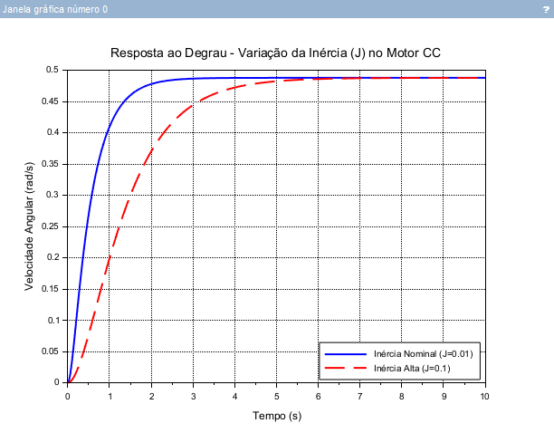

# Etapa 2: Modelagem e Simulação

## Introdução

A Etapa 2 deste Estudo Dirigido tem como foco a transição da teoria pura para a aplicação prática, focando na modelagem matemática de sistemas físicos reais, como circuitos elétricos e sistemas eletromecânicos. Enquanto a etapa anterior estabeleceu a base sobre estabilidade e análise no plano complexo, o objetivo agora é compreender como a física de um equipamento dita o seu comportamento dinâmico.

O fluxo de trabalho desta etapa segue uma progressão estruturada:

1. **Descrição Física:** Compreensão dos componentes do sistema (ex: resistores, indutores, rotores).
2. **Dedução Matemática:** Aplicação de leis físicas (Kirchhoff, Newton) para extrair as equações diferenciais no domínio do tempo.
3. **Domínio da Frequência:** Conversão dessas equações utilizando a Transformada de Laplace para obter a Função de Transferência.
4. **Simulação e Análise:** Utilização de software para aplicar sinais de teste (como o degrau unitário) e analisar como a alteração de parâmetros físicos modifica os polos e a resposta temporal do sistema.


Abaixo, detalhamos esse processo de modelagem para dois sistemas clássicos de engenharia: o Circuito RLC Série e o Motor de Corrente Contínua (CC).


## 1. Sistema Elétrico: Circuito RLC Série

### Descrição Física

O circuito consiste em um resistor (R), um indutor (L) e um capacitor (C) conectados em série a uma fonte de tensão de entrada. O objetivo principal da modelagem é analisar a tensão no capacitor como a saída do sistema frente a variações na entrada.

### Dedução das Equações Diferenciais

Aplicando a Lei de Kirchhoff das Tensões na malha única do circuito, a soma das quedas de tensão nos componentes deve ser igual à tensão da fonte:


$$v_i(t) = v_R(t) + v_L(t) + v_c(t)$$

As relações constitutivas de cada componente elétrico são:

* Resistor: $v_R(t) = R \cdot i(t)$
* Indutor: $v_L(t) = L \frac{di(t)}{dt}$
* Capacitor: $i(t) = C \frac{dv_c(t)}{dt}$

Substituindo a corrente $i(t)$ do capacitor nas equações do resistor e do indutor, e inserindo o resultado na equação da malha, obtemos a equação diferencial linear de segunda ordem que rege o sistema:


$$L C \frac{d^2v_c(t)}{dt^2} + R C \frac{dv_c(t)}{dt} + v_c(t) = v_i(t)$$

### Transformação para Função de Transferência

Para realizar a análise do sistema, aplicamos a Transformada de Laplace na equação diferencial, assumindo que as condições iniciais de energia (carga no capacitor e corrente no indutor) são nulas:


$$(LCs^2 + RCs + 1)V_c(s) = V_i(s)$$

Isolando a relação entre a saída e a entrada, obtemos a Função de Transferência $G(s)$:


$$G(s) = \frac{V_c(s)}{V_i(s)} = \frac{1}{LCs^2 + RCs + 1}$$


## 2. Sistema Eletromecânico: Motor de Corrente Contínua (CC)

### Descrição Física

O motor CC controlado pela armadura é um atuador fundamental em automação que converte energia elétrica em mecânica. O modelo é dividido em dois subsistemas acoplados:

* **Parte elétrica:** O circuito da armadura, composto por resistência (R) e indutância (L).
* **Parte mecânica:** O eixo do rotor e a carga acoplada, que possuem momento de inércia (J) e sofrem dissipação de energia por atrito viscoso (B).

### Dedução das Equações Diferenciais

O comportamento do motor é regido por duas equações diferenciais interdependentes:

1. **Equação da Malha Elétrica:**
A tensão aplicada é consumida pela impedância da armadura e pela força contra-eletromotriz gerada pela rotação do motor:

$$v(t) = R \cdot i(t) + L \frac{di(t)}{dt} + e_b(t)$$


Onde a força contra-eletromotriz é proporcional à velocidade angular: $e_b(t) = K_b \cdot \omega(t)$.
2. **Equação da Dinâmica Mecânica:**
O torque magnético gerado pelo motor deve vencer a inércia do rotor e o atrito do mancal:

$$T_m(t) = J \frac{d\omega(t)}{dt} + B\omega(t)$$


Onde o torque mecânico é diretamente proporcional à corrente da armadura: $T_m(t) = K_t \cdot i(t)$.

### Transformação para Função de Transferência

Aplicando a Transformada de Laplace em ambas as equações (com condições iniciais nulas):

1. Domínio elétrico:

$$V(s) = (R + Ls)I(s) + K_b\Omega(s)$$


2. Domínio mecânico:

$$K_t I(s) = (Js + B)\Omega(s) \implies I(s) = \frac{Js + B}{K_t}\Omega(s)$$


Substituindo $I(s)$ da equação mecânica na equação elétrica, conseguimos relacionar diretamente a velocidade angular $\Omega(s)$ à tensão de controle $V(s)$:


$$V(s) = (R + Ls) \left[ \frac{Js + B}{K_t}\Omega(s) \right] + K_b\Omega(s)$$

Reorganizando os termos, chegamos à Função de Transferência final do motor CC:


$$G(s) = \frac{\Omega(s)}{V(s)} = \frac{K_t}{(Ls + R)(Js + B) + K_t K_b}$$

Aqui está a continuação do seu documento, focada exclusivamente na simulação e análise, pronta para você copiar e colar logo abaixo da modelagem matemática que você já tem.

Utilizei a numeração a partir do item 3 para dar continuidade ao seu material.

---

## 3. Simulação Computacional no Scilab

Para validar a modelagem teórica e analisar o comportamento temporal do sistema, foi implementada uma simulação computacional utilizando a ferramenta Scilab. O sistema escolhido para a análise foi o Motor de Corrente Contínua (CC), que foi submetido a uma entrada em degrau unitário. O foco da simulação é observar o impacto da variação de parâmetros físicos na dinâmica do sistema.

### 3.1 Código de Simulação (SciNotes)

O script a seguir define a Função de Transferência do motor no domínio contínuo e compara a resposta temporal entre dois cenários: um motor com inércia nominal e outro com inércia elevada.

```scilab
// 1. Limpar memória e fechar janelas gráficas anteriores
clear; clc; clf;

// 2. Definir a variável complexa 's' para o domínio de Laplace
s = poly(0, 's');

// 3. Definir os parâmetros nominais do Motor CC
R = 1.0;   // Resistência da armadura (Ohms)
L = 0.5;   // Indutância (H)
B = 0.1;   // Atrito viscoso (N.m.s/rad)
Kt = 0.05; // Constante de torque
Kb = 0.05; // Constante de força contra-eletromotriz

// Vamos testar dois cenários de inércia para analisar o efeito temporal
J_nominal = 0.01; 
J_alto = 0.1;

// 4. Montar os denominadores para os dois cenários
den_nominal = (L*s + R)*(J_nominal*s + B) + Kt*Kb;
den_alto = (L*s + R)*(J_alto*s + B) + Kt*Kb;

// Numerador é igual para ambos
num = Kt;

// 5. Criar as Funções de Transferência no Scilab
sys_nominal = syslin('c', num, den_nominal);
sys_alto = syslin('c', num, den_alto);

// 6. Definir o vetor de tempo da simulação (de 0 a 10 segundos com passo de 0.01)
t = 0:0.01:10;

// 7. Simular a resposta ao degrau ('step')
y_nominal = csim('step', t, sys_nominal);
y_alto = csim('step', t, sys_alto);

// 8. Plotar as duas respostas no mesmo gráfico para comparação
plot(t, y_nominal, 'b', 'LineWidth', 2); // Linha azul grossa
plot(t, y_alto, 'r--', 'LineWidth', 2);  // Linha vermelha tracejada

// 9. Adicionar grade, título e legendas
xgrid();
xtitle('Resposta ao Degrau - Análise Dinâmica do Motor CC', 'Tempo (s)', 'Velocidade Angular (rad/s)');
legend('Inércia Nominal (J=0.01)', 'Inércia Alta (J=0.1)', 4);


```

### 3.2 Gráfico da Resposta Temporal

O resultado da execução do script gerou o gráfico abaixo, ilustrando o comportamento da velocidade angular do motor ao longo do tempo.



---

## 4. Discussão dos Resultados e Efeito da Variação de Parâmetros

A partir dos resultados obtidos na simulação e relacionando-os com a teoria de estabilidade, é possível destacar o efeito da variação de parâmetros nos polos e na dinâmica do sistema:

* **Efeito da Inércia ($J$):** Fisicamente, o aumento do momento de inércia representa uma oposição maior à variação de velocidade (eixo mais pesado ou carga maior). Matematicamente, aumentar o valor de $J$ no denominador da função de transferência desloca os polos do sistema em direção ao eixo imaginário no plano complexo. O reflexo prático disso pode ser visto no gráfico: a curva tracejada ($J$ alto) possui um tempo de subida e um tempo de acomodação visivelmente maiores, o que caracteriza uma resposta dinâmica mais lenta.
* **Efeito do Atrito Viscoso ($B$):** O atrito atua como um dissipador de energia no sistema. Caso esse parâmetro fosse reduzido drasticamente, os polos se moveriam, resultando em um sistema subamortecido. Nesse cenário, a resposta ao degrau apresentaria oscilações e ultrapassagens (*overshoot*) indesejadas antes de estabilizar.
* **Estabilidade e Regime Permanente:** Em ambos os cenários de inércia, o sistema estabiliza em um valor constante de velocidade. Isso demonstra que os polos permanecem na região estável (semiplano esquerdo do plano $s$).


---

## 4. Discussão dos Resultados e Análise de Polos

Conforme estabelecido nas diretrizes do estudo, a simulação computacional nos permite visualizar como a variação dos parâmetros físicos altera a posição dos polos no plano complexo (plano $s$) e, por consequência, a dinâmica temporal do sistema.

### 4.1. Análise do Sistema Eletromecânico (Motor CC)

O denominador da função de transferência do motor CC dita a localização de seus polos. Observando as simulações, podemos traçar o seguinte paralelo físico-matemático:

* **Variação da Inércia ($J$):** Fisicamente, a inércia representa a oposição que o rotor e a carga oferecem à aceleração. Matematicamente, ao aumentarmos o valor de $J$, os polos do sistema se deslocam para a direita no semiplano esquerdo (mais próximos da origem).
* *Impacto na dinâmica:* O decaimento exponencial torna-se mais lento. O sistema apresenta um **tempo de subida e tempo de acomodação visivelmente maiores** (como ilustrado na curva de inércia alta no gráfico anterior).


* **Variação do Atrito Viscoso ($B$):** O atrito atua dissipando energia do sistema.
* *Impacto na dinâmica:* Se o atrito ($B$) for reduzido a valores muito baixos em relação à inércia e indutância, os polos, que antes eram reais e distintos (sistema superamortecido), podem se tornar complexos conjugados (sistema subamortecido). Isso faria com que a resposta temporal apresentasse ultrapassagem (*overshoot*) e oscilações antes de estabilizar.


### 4.2. Análise do Sistema Elétrico (Circuito RLC)

No caso do circuito RLC modelado, a resistência ($R$) dita o fator de amortecimento ($\zeta$) do sistema:

* **Resistência Alta ($\zeta > 1$):** Os polos são reais e alocados no eixo horizontal do plano $s$. A resposta da tensão no capacitor atinge o regime permanente de forma lenta e sem oscilações (resposta superamortecida).
* **Resistência Baixa ($0 < \zeta < 1$):** Os polos movem-se para fora do eixo real, adquirindo parte imaginária. O sistema torna-se oscilatório (subamortecido). Se $R = 0$, os polos ficam exatamente sobre o eixo imaginário, e o sistema oscilaria indefinidamente .

### 4.3. Mapa de Polos e Zeros (Root Locus) no Plano $s$

Para ilustrar fisicamente o impacto da variação paramétrica, geramos o mapa de polos de ambos os sistemas utilizando o comando `plzr()` no Scilab.


**Análise do Diagrama:**
A representação no plano complexo confirma a relação direta entre a posição das raízes do denominador e a velocidade da resposta temporal:
1. **Sistema Nominal (Esquerda):** Os polos estão localizados mais à esquerda no semiplano negativo. Como a parte real determina a envoltória de decaimento exponencial ($e^{-\sigma t}$), polos mais distantes da origem resultam em uma dissipação mais rápida do transitório. O sistema responde e estabiliza rapidamente.
2. **Sistema com Alta Inércia (Direita):** Observa-se que o aumento da inércia ($J$) "puxou" os polos em direção à origem ($s = 0$). Polos próximos à origem atuam como "âncoras" dinâmicas: a constante de tempo do sistema aumenta drasticamente, resultando naquela resposta lenta e preguiçosa que observamos no gráfico de resposta ao degrau. 

Isso prova matematicamente o conceito físico: é necessário muito mais tempo e esforço para alterar o estado de movimento de uma massa (ou inércia) maior.

---

## 5. Relação com Aplicações Reais

A modelagem de funções de transferência e a simulação das respostas dinâmicas são fundamentais para o projeto de controle em diversas aplicações práticas na indústria:

1. **Automação Industrial e Robótica:** Braços manipuladores utilizam motores CC para posicionamento de juntas. Se o robô agarrar um objeto pesado (aumento abrupto da inércia $J$), sua dinâmica natural se altera, tornando-se mais lenta. O controlador do sistema deve ser projetado considerando essa variação paramétrica para evitar imprecisões e atrasos na linha de produção.
2. **Sistemas de Tração de Veículos Elétricos:** O motor que traciona o veículo sofre constantes variações de parâmetros. Ao subir uma ladeira ou transportar mais passageiros, a inércia e as forças resistivas se alteram. A modelagem permite criar estratégias de controle para que a entrega de torque seja eficiente em qualquer cenário.
**Filtros Passivos (Sistemas RLC):** Trazendo a análise para o domínio elétrico, a variação dos componentes $R$, $L$ e $C$ define a frequência de corte e a taxa de amortecimento de filtros utilizados em fontes de alimentação, protegendo circuitos sensíveis de ruídos e picos de tensão.


