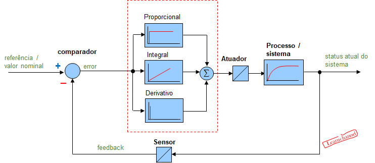
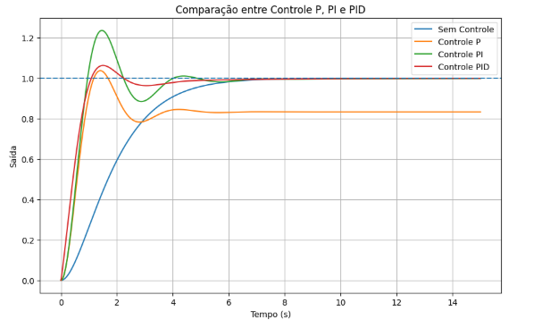

# Etapa 3 – Controle e PID

## Introdução

Após o estudo da modelagem matemática de sistemas dinâmicos e da análise de suas respostas temporais, o próximo passo natural consiste em desenvolver mecanismos capazes de controlar o comportamento desses sistemas de maneira desejada.

Em aplicações reais, sistemas físicos estão constantemente sujeitos a perturbações, variações de carga, ruídos e mudanças de parâmetros. Dessa forma, apenas modelar o sistema não é suficiente: é necessário implementar estratégias de controle capazes de garantir estabilidade, precisão e rapidez na resposta.

Dentre os diversos métodos existentes, o controlador PID (Proporcional–Integral–Derivativo) destaca-se como uma das técnicas mais utilizadas na engenharia de controle, devido à sua simplicidade, robustez e eficiência prática.

O objetivo desta etapa é compreender o funcionamento do controle em malha fechada, estudar matematicamente o controlador PID, analisar o efeito individual de cada termo de controle e investigar os desafios de sua implementação digital em sistemas embarcados.

---

# 1. Fundamentação Teórica

## 1.1 Controle em Malha Fechada

Em um sistema de controle em malha fechada, a saída do sistema é constantemente medida e comparada com um valor de referência desejado.

A diferença entre o valor desejado e o valor medido é denominada erro:

e(t)=r(t)-y(t)

Onde:

* ( r(t) ) representa o sinal de referência;
* ( y(t) ) representa a saída do sistema;
* ( e(t) ) representa o erro.

O controlador utiliza esse erro para gerar um sinal de controle capaz de corrigir o comportamento do sistema.

A principal vantagem da malha fechada é sua capacidade de compensar perturbações e reduzir erros automaticamente.

---

## 1.2 Estrutura do Controlador PID



> Figura 1 – Estrutura clássica de um sistema de controle em malha fechada utilizando controlador PID. O sinal de saída é continuamente realimentado ao sistema para reduzir o erro entre referência e saída.


O controlador PID combina três ações distintas:

* Controle Proporcional (P)
* Controle Integral (I)
* Controle Derivativo (D)

Sua equação contínua é dada por:

$$u_D(t)=K_d\frac{de(t)}{dt}$$
Onde:

* (K_p) → ganho proporcional;
* (K_i) → ganho integral;
* (K_d) → ganho derivativo;
* (u(t)) → sinal de controle aplicado ao sistema.

Cada termo possui uma função específica na dinâmica do sistema.

---

## 1.3 Ação Proporcional (P)

A ação proporcional atua diretamente sobre o erro atual do sistema.

$$u_P(t)=K_p e(t)$$

### Características

* Aumenta a velocidade de resposta;
* Reduz o erro instantâneo;
* Pode gerar overshoot elevado se o ganho for muito alto.

### Interpretação Física

Quanto maior o erro, maior será a ação corretiva aplicada pelo controlador.

Por exemplo:

* Se um motor estiver muito abaixo da velocidade desejada, o controlador aumenta rapidamente a tensão aplicada.

---

## 1.4 Ação Integral (I)

A ação integral acumula o erro ao longo do tempo.

$$u_I(t)=K_i\int e(t)dt$$

### Características

* Elimina erro em regime permanente;
* Corrige pequenas diferenças persistentes;
* Pode tornar o sistema mais lento;
* Pode causar oscilações excessivas.

### Interpretação Física

Mesmo que o erro instantâneo seja pequeno, o termo integral continua acumulando erro histórico até que a saída alcance exatamente o valor desejado.

---

## 1.5 Ação Derivativa (D)

A ação derivativa atua sobre a taxa de variação do erro.

$$u_D(t)=K_d\frac{de(t)}{dt}$$

### Características

* Atua antecipando tendências futuras;
* Reduz overshoot;
* Melhora o amortecimento;
* É sensível a ruídos.

### Interpretação Física

Se o erro estiver variando rapidamente, o controlador age preventivamente para evitar ultrapassagens excessivas.

---

# 2. Simulação e Análise de Desempenho

## 2.1 Sistema Utilizado

Para análise do controlador PID, foi utilizado um sistema de segunda ordem semelhante ao motor CC estudado anteriormente.

A função de transferência adotada foi:

$$G(s)=\frac{1}{s^2+2s+1}$$

Esse modelo apresenta comportamento estável e permite observar claramente os efeitos das diferentes ações de controle.

---

## 2.2 Implementação do PID no Scilab

O código abaixo implementa o sistema em malha fechada utilizando controlador PID.

```scilab
clear; clc; clf;

// Variável de Laplace
s = poly(0, 's');

// Planta do sistema
G = 1 / (s^2 + 2*s + 1);

// Ganhos PID
Kp = 5;
Ki = 2;
Kd = 1;

// Controlador PID
C = Kp + Ki/s + Kd*s;

// Sistema em malha fechada
T = syslin('c', C*G/(1 + C*G));

// Vetor de tempo
t = 0:0.01:20;

// Resposta ao degrau
y = csim('step', t, T);

// Plot
plot(t, y);
xgrid();

xtitle("Resposta ao Degrau com PID",
       "Tempo (s)",
       "Saída");
```

---

## 2.3 Análise do Controle Proporcional

Ao aumentar apenas o ganho proporcional (K_p):

* o sistema responde mais rapidamente;
* o tempo de subida diminui;
* o overshoot aumenta;
* o sistema pode se tornar oscilatório.

Fisicamente, isso significa que o controlador reage de forma mais agressiva ao erro.

---

## 2.4 Análise do Controle Integral

Ao adicionar o termo integral:

* o erro em regime permanente tende a zero;
* o sistema torna-se mais preciso;
* o tempo de acomodação pode aumentar.

O termo integral é extremamente importante em aplicações industriais onde pequenas diferenças acumuladas são inaceitáveis.

---

## 2.5 Análise do Controle Derivativo

A inclusão do termo derivativo:

* reduz oscilações;
* melhora o amortecimento;
* reduz overshoot.

O controlador passa a “prever” o comportamento futuro do erro.



> Figura 2 – Comparação da resposta ao degrau para diferentes estratégias de controle. Observa-se que o controlador PID apresenta melhor compromisso entre rapidez, estabilidade e erro em regime permanente.
---

## 2.6 Critérios de Desempenho

Durante as simulações, os seguintes parâmetros foram analisados:

### Tempo de subida

Tempo necessário para a saída atingir o valor desejado pela primeira vez.

### Tempo de acomodação

Tempo necessário para o sistema estabilizar dentro de uma faixa aceitável.

### Overshoot

Valor máximo ultrapassado antes da estabilização.

### Erro em regime permanente

Diferença final entre a referência e a saída do sistema.

---

# 3. Implementação Digital e Sistemas Embarcados

## 3.1 Necessidade de Discretização

Em sistemas embarcados, o controlador é executado digitalmente em microcontroladores, DSPs ou FPGAs.

Nesses dispositivos, o controlador não opera continuamente no tempo, mas em intervalos discretos de amostragem.

Assim, a equação contínua do PID deve ser discretizada.

---

## 3.2 PID Discreto

A aproximação discreta do PID pode ser escrita como:

$$u[k]=K_pe[k]+K_i\sum e[k]T_s+K_d\frac{e[k]-e[k-1]}{T_s}$$

Onde:

* (T_s) é o período de amostragem;
* (k) representa o instante discreto.

---

## 3.3 Aspectos Práticos em Sistemas Embarcados

### Taxa de Amostragem

A frequência de amostragem deve ser suficientemente alta para representar corretamente a dinâmica do sistema.

Taxas muito baixas podem causar:

* instabilidade;
* atraso excessivo;
* perda de desempenho.

---

### Saturação

Na prática, atuadores possuem limites físicos.

Por exemplo:

* tensão máxima;
* corrente máxima;
* velocidade máxima.

Quando o controlador exige um valor acima do permitido, ocorre saturação.

---

### Integral Windup

O efeito windup ocorre quando o termo integral continua acumulando erro mesmo com o atuador saturado.

Isso pode causar:

* overshoot excessivo;
* demora na estabilização;
* instabilidade.

Uma solução comum consiste em limitar o termo integral.

---

# 4. Aplicações Práticas

O controlador PID está presente em praticamente toda a indústria moderna.

## 4.1 Controle de Velocidade de Motores

Motores CC utilizam PID para manter velocidade constante mesmo sob variações de carga.

---

## 4.2 Controle de Temperatura

Sistemas térmicos utilizam PID para controlar:

* fornos;
* estufas;
* impressoras 3D;
* sistemas HVAC.

---

## 4.3 Robótica

Braços robóticos utilizam PID para:

* posicionamento preciso;
* controle de torque;
* estabilidade de movimento.

---

## 4.4 Drones e Veículos Autônomos

Controladores PID são fundamentais para:

* estabilização de voo;
* controle de altitude;
* navegação.

---

# 5. Discussão dos Resultados

As simulações demonstraram claramente que cada termo do PID influencia diretamente o comportamento dinâmico do sistema.

* O termo proporcional melhora a rapidez da resposta;
* O termo integral elimina erro permanente;
* O termo derivativo melhora estabilidade e amortecimento.

A combinação adequada dos três termos permite obter sistemas rápidos, estáveis e precisos.

Entretanto, a sintonia inadequada dos ganhos pode tornar o sistema instável, evidenciando a importância do ajuste correto do controlador.

Além disso, observou-se que a implementação digital introduz desafios adicionais relacionados à discretização, limitação computacional e saturação dos atuadores.

---

# Conclusão

O controlador PID representa uma das ferramentas mais importantes da engenharia de controle devido à sua simplicidade e eficiência prática.

Ao longo desta etapa, foi possível compreender:

* o funcionamento do controle em malha fechada;
* a influência dos termos proporcional, integral e derivativo;
* os principais critérios de desempenho dinâmico;
* os desafios da implementação digital em sistemas embarcados.

As simulações demonstraram que o PID é capaz de melhorar significativamente a estabilidade, rapidez e precisão dos sistemas dinâmicos.

Dessa forma, o estudo do PID estabelece uma ponte fundamental entre a modelagem matemática estudada nas etapas anteriores e o desenvolvimento de sistemas reais de automação e controle.
