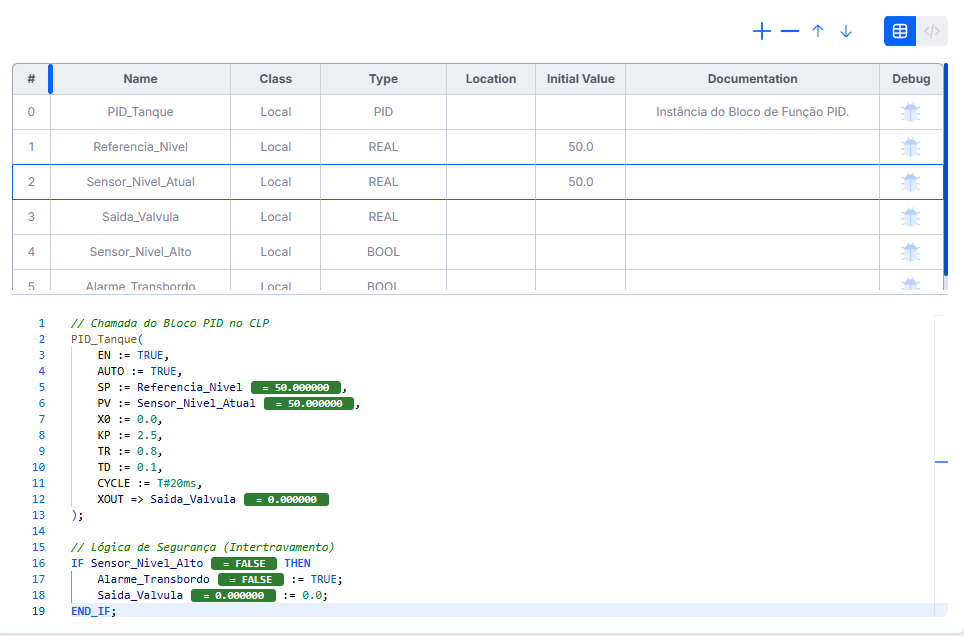

# Etapa 4 – Automação Industrial e Tecnologias

## Introdução

Após a modelagem matemática de sistemas físicos e a sintonia de controladores (como o PID) nas etapas anteriores, agora iremos ver como em conectar esses conceitos teóricos em aplicações reais de engenharia. 

No ambiente industrial, o controle não ocorre de forma isolada. Ele está integrado a uma infraestrutura tecnológica robusta que permite a aquisição de dados, o processamento lógico, a supervisão em tempo real e a comunicação entre dispositivos.

Iremos explorar as tecnologias fundamentais da automação industrial, Assim como suas linguagens e ferramentas de programação de Controladores Lógicos Programáveis (CLPs), apresentar aplicações simuladas e discutir tendências avançadas, como o Controle Preditivo e a Inteligência Artificial.

---

# 1. Fundamentos da Automação Industrial

A automação industrial moderna é composta por uma hierarquia de dispositivos e sistemas que trabalham em conjunto para garantir o controle eficiente e seguro dos processos.

## 1.1 Elementos Fundamentais

* **Sensores Industriais:** São os "sentidos" do sistema. Eles convertem grandezas físicas (temperatura, pressão, nível, posição) em sinais elétricos interpretáveis pelo controlador.
* **CLPs (Controladores Lógicos Programáveis):** São os "cérebros" da automação. Computadores industriais robustos e projetados para executar lógicas de controle de forma determinística e confiável, substituindo antigos painéis de relés.
* **Sistemas Supervisórios e IHMs (Interfaces Homem-Máquina):** Permitem a interação humana com o processo. As IHMs ficam no chão de fábrica para operação local, enquanto os supervisórios (SCADA) monitoram plantas inteiras, registrando históricos e alarmes.
* **Protocolos de Comunicação:** Regras que permitem a troca de dados entre sensores, CLPs e supervisórios (ex: Modbus, Profibus, Ethernet/IP).

---

# 2. Programação de CLPs e Ferramentas

## 2.1 Linguagens de Programação (Norma IEC 61131-3)

A programação de CLPs é padronizada, permitindo que engenheiros desenvolvam lógicas de forma estruturada. As duas linguagens de maior destaque investigadas nesta etapa são:

### Diagrama Ladder (LD)
Uma linguagem gráfica baseada em esquemas elétricos de contatos e bobinas. É intuitiva e amplamente utilizada para lógicas de intertravamento, controle discreto e acionamento de motores.

### Texto Estruturado (Structured Text - ST)
Uma linguagem textual de alto nível, semelhante ao C ou Pascal. É ideal para algoritmos matemáticos complexos, como a implementação de um controlador PID discretizado ou cálculos de malha fechada.

## 2.2 Ferramentas de Mercado

Para o desenvolvimento e simulação, o mercado e a academia utilizam diversos softwares:

* **CodeSys:** Uma das plataformas mais utilizadas mundialmente, compatível com CLPs de diversos fabricantes, oferecendo simulação robusta e suporte a todas as linguagens IEC.
* **OpenPLC:** Uma alternativa *open-source* que permite transformar hardwares comuns (como microcontroladores e embarcados) em um CLP totalmente funcional, excelente para fins didáticos e prototipagem.

---

# 3. Simulação e Aplicações Práticas

Para relacionar os conceitos de controle com sistemas reais, foi desenvolvida uma aplicação demonstrativa integrando controle em malha fechada e lógica industrial.

Markdown
## 3.1 Controle de Processo Simulado: Nível de um Tanque

Para relacionar os conceitos teóricos com sistemas reais, foi desenvolvida uma aplicação demonstrativa integrando controle em malha fechada e lógicas de segurança em um ambiente industrial simulado.

O problema consiste em manter o nível de um reservatório de líquido no valor de referência desejado (*setpoint*), utilizando uma válvula proporcional (atuador) controlada por um CLP. A lógica foi desenvolvida utilizando a linguagem Texto Estruturado (ST) e o bloco de função PID padrão da norma IEC 61131-3.

Após os devidos ajustes de sintaxe e parametrização do controlador, o código final estruturado na rotina principal (`MAIN`) ficou da seguinte forma:

```iecst
// Chamada do Bloco PID no CLP
PID_Tanque(
    EN := TRUE,
    AUTO := TRUE,
    SP := Referencia_Nivel,
    PV := Sensor_Nivel_Atual,
    X0 := 0.0, 
    KP := 2.5,
    TR := 0.8,
    TD := 0.1,
    CYCLE := T#20ms,
    XOUT => Saida_Valvula
);

// Lógica de Segurança (Intertravamento)
IF Sensor_Nivel_Alto THEN
    Alarme_Transbordo := TRUE;
    Saida_Valvula := 0.0;
END_IF;

```
A declaração das variáveis no OpenPLC seguiu a tipagem rigorosa exigida por CLPs industriais, alocando variáveis do tipo REAL para grandezas analógicas contínuas (como as leituras de sensor e o comando da válvula) e variáveis do tipo BOOL para os intertravamentos discretos de segurança (como o sensor de nível alto e o alarme).

O trecho final do código demonstra uma prática comum na indústria: independentemente do cálculo matemático perfeito do PID, sistemas críticos precisam de lógicas de intertravamento. Caso o sensor de nível alto seja acionado, a saída para a válvula é forçada a 0.0 por segurança, sobrepondo o comando do controlador.



## 3.2 Análise Prática: Discretização e Efeito Windup

Durante a execução da simulação no OpenPLC Editor, dois fenômenos fundamentais da teoria de controle discreto foram observados na prática, evidenciando as nuances de se traduzir equações matemáticas contínuas para um ambiente digital baseado em microcontroladores e CLPs.

### A Necessidade de Discretização e a Parametrização do Tempo de Amostragem ($T_s$)
Inicialmente, a omissão ou parametrização incorreta do pino de tempo de ciclo resultou em um erro de indeterminação matemática (`NaN` - *Not a Number*). Na teoria de controle contínuo, as derivadas e integrais operam em um fluxo temporal ininterrupto. No entanto, sistemas digitais operam de forma discreta, amostrando sinais em intervalos periódicos. 

A ação derivativa calcula a taxa de variação do erro dividida pelo período de amostragem ($T_s$). Caso esse tempo seja nulo ou mal interpretado pelo compilador (como um operando decimal comum ao invés do tipo de dado estruturado `TIME`), ocorre uma divisão por zero. A correção exigiu a especificação rigorosa do tempo de ciclo através da sintaxe padrão da norma IEC 61131-3 (utilizando `CYCLE := T#20ms`), forçando o bloco a sincronizar sua matemática com o ciclo real de varredura (*scan cycle*) da CPU do CLP.

### Identificação Prática do Fenômeno Integral Windup
Ao parametrizar o *setpoint* em $50.0$ com o sensor de nível (PV) estagnado em $0.0$, observou-se uma saturação massiva no sinal de saída (`XOUT`), que atingiu rapidamente valores inconsistentes com a realidade física (valores negativos extrapolando a faixa nominal). 

Esse comportamento ilustra o fenômeno do **Integral Windup** (Saturação da Integral). Como o erro entre a referência e a variável de processo permaneceu estático e o atuador simulado não gerou uma resposta de realimentação imediata, o termo integral continuou a somar o erro acumulado a cada ciclo de varredura de 20ms. Em sistemas reais, os atuadores possuem limites físicos severos (como uma válvula que só opera entre $0\%$ e $100\%$). Sem algoritmos de proteção *anti-windup* implementados na lógica do CLP para congelar a ação integral durante a saturação, o controlador continuará acumulando um erro fictício, provocando atrasos críticos e oscilações severas quando o sistema finalmente tentar retornar ao ponto de ajuste.

---

# 4. Tópicos Avançados em Controle e Automação

O controlador PID e a automação baseada em relés e lógicas booleanas formaram a base da Terceira Revolução Industrial. Atualmente, a complexidade dos sistemas dinâmicos e a necessidade de eficiência energética exigem a integração do controle clássico com tecnologias computacionais e de comunicação avançadas, caracterizando o cenário da Indústria 4.0.

## 4.1 Controle Preditivo Baseado em Modelo (MPC)

Diferente do PID, que atua de forma puramente *reativa* a um erro passado (ação integral) ou presente (ação proporcional), o Controle Preditivo Baseado em Modelo (MPC - *Model Predictive Control*) é uma estratégia *proativa*. Ele utiliza um modelo matemático interno da planta (geralmente em espaço de estados ou matrizes de resposta ao degrau) para simular e prever a evolução futura da variável controlada antes mesmo que o erro aconteça.

### Estratégia de Horizonte Deslizante e Otimização
O MPC calcula uma sequência futura de ações de controle, mas aplica apenas o primeiro passo no processo real. No instante de amostragem seguinte, ele atualiza as medições dos sensores de campo e repete toda a otimização matemática. Esse mecanismo é conhecido como **horizonte deslizante** (*receding horizon*).

A matemática do MPC resolve, a cada ciclo de varredura do processador, um problema de otimização convexa focado em minimizar uma função de custo quadrática ($J$):

$$J = \sum_{i=1}^{H_p} \| y(k+i|k) - r(k+i) \|_{Q}^2 + \sum_{i=0}^{H_c-1} \| \Delta u(k+i|k) \|_{R}^2$$

Onde:
* $H_p$ é o horizonte de predição (quantos passos à frente o modelo "enxerga").
* $H_c$ é o horizonte de controle (quantos passos de cálculo o algoritmo pode variar a saída).
* $y$ é a saída prevista pelo modelo dinâmico e $r$ é a referência desejada.
* $\Delta u$ é a variação do esforço de controle no atuador.
* As matrizes $Q$ e $R$ são pesos de sintonia: $Q$ pune o desvio de rastreamento da referência, enquanto $R$ pune ações bruscas nas válvulas ou motores, preservando a vida útil do equipamento mecânico.

### Restrições Operacionais (Constraints) e Sistemas MIMO
A maior superioridade do MPC frente ao controle clássico em aplicações pesadas é a sua capacidade nativa de gerenciar sistemas multivariáveis (MIMO - *Multiple Input, Multiple Output*) com forte acoplamento dinâmico, como colunas de destilação em refinarias. 

Além disso, o algoritmo lida matematicamente com restrições operacionais rígidas de forma direta. O MPC diferencia *hard constraints* (limites físicos que não podem ser violados em hipótese alguma, como a saturação geométrica de uma válvula limitando a abertura entre **0%** e **100%**) de *soft constraints* (limites de processo que toleram pequenas infrações temporárias). Isso garante que o sistema opere sempre no seu limite máximo de eficiência econômica sem comprometer a estabilidade e a segurança da planta.

---

## 4.2 Inteligência Artificial e Controle Adaptativo

A Inteligência Artificial (IA) tem revolucionado a automação ao lidar com sistemas cujos modelos matemáticos são excessivamente complexos, não lineares, estocásticos ou incertos para a aplicação rigorosa do MPC ou do PID tradicional.

* **Controle baseado em Lógica Fuzzy:** Um marco inicial da inteligência na automação, a lógica *fuzzy* abstrai equações diferenciais substituindo-as por regras linguísticas de especialistas humanos (ex: "SE a temperatura está subindo rápido E o erro é grande, ENTÃO feche a válvula drasticamente"). É amplamente utilizado em sistemas onde a modelagem matemática exata é inviável.
* **Redes Neurais como *Soft Sensors* (Sensores Virtuais):** Em muitos processos industriais complexos (como reações químicas em bioprocessos), medir a variável de interesse em tempo real é fisicamente impossível ou requer análises laboratoriais demoradas. Redes Neurais Artificiais são treinadas para atuar como estimadores de estado, calculando a variável oculta a partir de dados periféricos rápidos (como pressão e temperatura), permitindo fechar a malha de controle sem atrasos de leitura.
* ***Auto-Tuning* Inteligente e Aprendizado por Reforço:** O desgaste mecânico altera a dinâmica da planta ao longo dos anos, deslocando os polos do sistema. Modelos de IA baseados em *Reinforcement Learning* podem monitorar o comportamento de uma malha fechada e, atuando como "agentes", realizar a auto-sintonia adaptativa dos ganhos $K_p$, $K_i$ e $K_d$ em tempo real, mantendo o controle otimizado e lidando com perturbações não previstas no modelo original.

---

## 4.3 Integração IIoT e Computação de Borda (*Edge Computing*)

Para que modelos avançados rodem de forma eficiente, a arquitetura clássica dos CLPs passou por reformulações. Através da Internet das Coisas Industrial (IIoT), protocolos de comunicação modernos (como o OPC UA e MQTT) permitem que os dados dos sensores fluam bidirecionalmente do chão de fábrica para plataformas em nuvem. 

Contudo, como malhas de controle exigem latência mínima para garantir a estabilidade do sistema, a Indústria 4.0 aplica o conceito de *Edge Computing*. Em vez de enviar todos os dados para servidores remotos calcularem a ação de controle (o que adicionaria um atraso fatal na correção de perturbações), o processamento pesado do MPC ou das inferências de Inteligência Artificial ocorre diretamente em Controladores de Automação Programáveis (PACs) e *Gateways* de Borda, alocados fisicamente ao lado do equipamento.

---

# Conclusão

A trajetória consolidada ao longo deste estudo dirigido revela que a engenharia de controle e automação é, em sua essência, uma disciplina profundamente integrada, onde a abstração matemática e a realidade física operam em simbiose. Tudo se inicia na compreensão física do fenômeno e no levantamento rigoroso de equações diferenciais, permitindo que ferramentas como a Transformada de Laplace mapeiem o fluxo de energia e definam a estabilidade intrínseca da planta através da disposição de polos e zeros. Com esse modelo dinâmico bem fundamentado, o controlador PID surge como a ferramenta teórica fundamental capaz de moldar o comportamento temporal, forçando a variável de processo a rastrear referências precisas, mitigando ruídos por meio da ação derivativa e garantindo a eliminação de erros sistêmicos através da ação integral.

Entretanto, é no ambiente da automação industrial que esses modelos teóricos são submetidos aos testes de estresse impostos pelas leis da física e das limitações tecnológicas. Conforme evidenciado pelas simulações práticas de controle programadas em Texto Estruturado, a alocação perfeita de um polo no plano complexo não é suficiente se a implementação digital ignorar os gargalos da infraestrutura. O tempo de amostragem deve respeitar estritamente a taxa de varredura (*scan cycle*) dos CLPs, e fenômenos matemáticos que não existem na análise contínua, como a saturação exponencial da variável de controle (*Integral Windup*), exigem a implementação imediata de lógicas de segurança. Portanto, a automação industrial atua como o elo definitivo que amarra a estabilidade da teoria dos sistemas dinâmicos com os protocolos de comunicação, as limitações dos conversores analógico-digitais e os intertravamentos de chão de fábrica, definindo os requisitos essenciais para projetar tecnologias capazes de operar de forma segura e otimizada nas exigentes demandas modernas.
