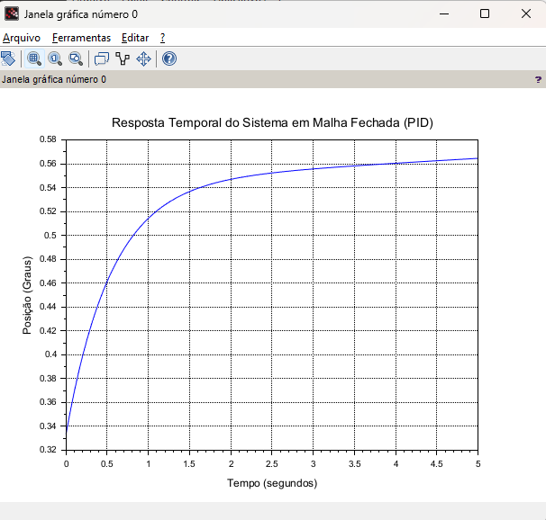
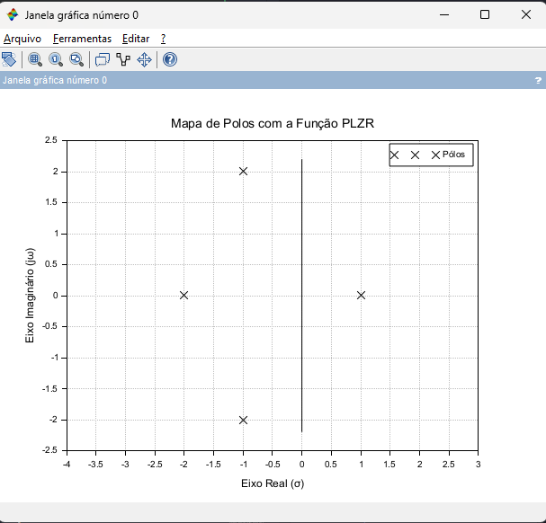

# 1. Introdução

### Resumo Teórico

A teoria de controle estuda métodos para fazer sistemas dinâmicos seguirem um comportamento desejado. Em sistemas realimentados, a saída é continuamente comparada com uma referência, gerando um erro utilizado pelo controlador para corrigir o sistema.

O controlador PID é um dos algoritmos mais utilizados na indústria devido à sua simplicidade e eficiência.

### Aplicações Práticas

- Controle de temperatura de fornos
- Controle de velocidade de motores
- Controle de posição de servomotores
- Controle de nível de reservatórios
- Controle de vazão em processos industriais

---

# 2. Descrição do Sistema Desenvolvido

## Componentes Utilizados

| Componente    | Função                     |
| ------------- | -------------------------- |
| ESP32         | Controlador                |
| Potenciômetro | Referência (setpoint)      |
| Servo Motor   | Atuador                    |
| OLED SSD1306  | Interface de monitoramento |

---

## Diagrama de Blocos

```text
            Referência
          (Potenciômetro)
                  │
                  ▼
            +-----------+
            |    PID    |
            +-----------+
                  │
                  ▼
            +-----------+
            |  Planta   |
            +-----------+
                  │
                  ▼
             Posição
                  │
                  └──────► Realimentação
```

---

# 3. Modelagem Matemática da Planta

## Resumo Teórico

A dinâmica do servo foi representada por um sistema de primeira ordem.

Sistemas de primeira ordem são amplamente utilizados para modelar motores, sistemas térmicos e hidráulicos.

---

## Definições Matemáticas

Equação diferencial:

$$
\frac{d\theta}{dt}=
\frac{u-\theta}{\tau}
$$

onde:

- (u) = sinal de controle
- $(\theta) =$ posição do sistema
- $(\tau) =$ constante de tempo

Transformando para Laplace:

$$
G(s)=\frac{1}{0.8s+1}
$$

---

## Discussão da Modelagem

A modelagem matemática é uma etapa fundamental em projetos de controle, pois permite prever o comportamento do sistema antes de sua implementação física. Neste trabalho foi adotado um modelo de primeira ordem para representar a dinâmica do servomotor.

Embora um servomotor real possua características não lineares, atrito mecânico, saturação e limitações eletrônicas, o modelo de primeira ordem é suficiente para representar seu comportamento dominante e possibilitar a aplicação dos conceitos de controle estudados na disciplina.

A constante de tempo adotada $((\tau = 0,8))$ representa a rapidez com que a saída responde às variações do sinal de controle. Quanto menor esse valor, mais rápida será a resposta do sistema.

A utilização de uma função de transferência simplificada permite analisar estabilidade, polos e resposta temporal de forma objetiva, facilitando o projeto do controlador PID.

---

# 4. Análise de Polos

## Resumo Teórico

Os polos determinam estabilidade e velocidade da resposta.

Para um sistema ser estável, seus polos devem estar no semiplano esquerdo.

---

## Definições Matemáticas

Denominador:

$$
0.8s+1=0
$$

Polo:

$$
s=-1.25
$$

---

## Resultado

O sistema possui:

- 1 polo real negativo
- Resposta estável
- Sem oscilações

### Discussão dos Resultados

A presença de um polo localizado em (s=-1,25) indica que a resposta natural do sistema decai exponencialmente ao longo do tempo. Como o polo encontra-se no semiplano esquerdo do plano complexo, o sistema é assintoticamente estável.

Sistemas de primeira ordem apresentam comportamento previsível e não possuem oscilações naturais, característica observada neste projeto. Isso torna a sintonia do controlador PID mais simples quando comparada a sistemas de ordem superior.

---

# 5. Simulação Computacional

## Simulação Contínua no Scilab

Antes da implementação digital em linguagem C++, o comportamento teórico do sistema em malha fechada foi validado via simulação matemática no software Scilab. Isso permitiu prever a dinâmica exata da função de transferência de primeira ordem sem as limitações de hardware.

```scilab
// Parâmetros do sistema contínuo
s = %s;
tau = 0.8;
G = syslin('c', 1, tau*s + 1);

// Ganhos do PID
Kp = 2.0;
Ki = 0.3;
Kd = 0.1;

// Controlador PID e Malha Fechada
C = syslin('c', Kd*s^2 + Kp*s + Ki, s);
H = (C * G) /. 1;

// Simulação de resposta ao degrau
t = 0:0.05:5;
y = csim('step', t, H);
```



### Representação Gráfica no Plano s (Mapa de Polos)

Para consolidar a análise matemática, o comportamento dinâmico do sistema foi validado visualmente através do mapeamento de seus polos no plano complexo (Plano $s$) utilizando a função nativa `plzr` do software Scilab. Esta técnica permite extrair as raízes do denominador da função de transferência de forma automatizada e plotá-las graficamente.

O código a seguir gera o diagrama de polos para a planta modelada no projeto:

```scilab
// Variável complexa de Laplace
s = %s;

// Parâmetro da planta (constante de tempo)
tau = 0.8;

// Definição da Função de Transferência G(s) = 1 / (0.8s + 1)
G = syslin('c', 1, tau*s + 1);

// Limpa a janela gráfica e plota o Mapa de Polos e Zeros
clf();
plzr(G);

// Configuração dos títulos do gráfico
xtitle("Mapa de Polos da Planta", "Eixo Real (σ)", "Eixo Imaginário (jω)");

```



**Interpretação do Diagrama no Plano Complexo:**
A execução deste script no Scilab gera um gráfico contendo uma marcação ("X") exatamente sobre o eixo real, na coordenada $\sigma = -1.25$. Esta representação gráfica comprova visualmente as premissas teóricas adotadas: o sistema possui estabilidade absoluta (polo no semiplano esquerdo) e ausência de oscilação natural (ausência de parte imaginária).

### Transição para a Implementação Digital: Discretização e Limites Físicos

A simulação contínua e o mapa de polos no Scilab validam o comportamento teórico ideal do sistema. No entanto, para embarcar esse controle no microcontrolador ESP32, é necessário traduzir o modelo matemático para o ambiente discreto digital.

Essa transição exige a resolução de dois desafios práticos inerentes à automação industrial:

- **Discretização Matemática:** Como os microcontroladores operam em ciclos de varredura periódicos, as equações diferenciais (tanto da dinâmica da planta quanto das ações integral e derivativa do PID) precisam ser solucionadas por métodos de aproximação numérica, como o Método de Euler. A variável `dt` no código atuará como o tempo de amostragem ($T_s$), garantindo a sincronia da matemática com o processador do hardware.
- **Prevenção do Efeito Windup:** Enquanto o plano complexo e as equações contínuas aceitam valores infinitos, o atuador físico (servomotor) possui restrições mecânicas rígidas (opera apenas entre 0° e 180°). Sem as devidas travas no código, o limite físico causaria o acúmulo irreal de erro no controlador, gerando o fenômeno de saturação _Integral Windup_.

Os blocos de código a seguir demonstram como essas adaptações da teoria para a prática foram implementadas em linguagem C++.

## Código Completo da Planta

```cpp
float tau = 0.8;
float dt = 0.02;

float posicao = 90.0;
float controle = 90.0;

void atualizarPlanta()
{
    posicao =
        posicao +
        ((controle - posicao) / tau) * dt;

    if(posicao < 0)
        posicao = 0;

    if(posicao > 180)
        posicao = 180;
}
```

### Explicação

Este trecho implementa numericamente a equação diferencial da planta utilizando o método de Euler.

A cada período de amostragem, a posição é atualizada em função do sinal de controle produzido pelo PID. Os limites impostos garantem que a posição permaneça dentro da faixa física do servomotor.

---

## Código Completo do PID

```cpp
float Kp = 2.0;
float Ki = 0.3;
float Kd = 0.1;

float erro = 0;
float erroAnterior = 0;
float integral = 0;
float derivada = 0;

float referencia = 90;
float controle = 90;

void calcularPID()
{
    erro = referencia - posicao;

    integral += erro * dt;

    derivada =
        (erro - erroAnterior) / dt;

    controle =
        Kp * erro +
        Ki * integral +
        Kd * derivada;

    erroAnterior = erro;

    // Lógica de Segurança (Intertravamento)
    if (posicao >= 175) {
        controle = 0;
        integral = 0;
    } else {
        if(controle < 0) controle = 0;
        if(controle > 180) controle = 180;
    }
}
```

### Explicação

O controlador PID calcula continuamente o erro entre a referência e a posição atual do sistema.

A parcela proporcional atua diretamente sobre o erro instantâneo. A parcela integral acumula erros ao longo do tempo, eliminando erros permanentes. Já a parcela derivativa atua sobre a taxa de variação do erro, contribuindo para a redução de oscilações.

---

## Resumo Teórico

O PID combina:

- Ação proporcional
- Ação integral
- Ação derivativa

para reduzir erro e melhorar a estabilidade.

### Discussão do Controlador

A combinação das três ações confere ao PID uma grande robustez para lidar com perturbações reais.

A ação proporcional fornece rapidez de resposta. A ação integral elimina o erro estacionário. A ação derivativa melhora a estabilidade e reduz oscilações.

Quando corretamente ajustado, o controlador permite obter respostas rápidas, estáveis e com pequeno erro em regime permanente.

---

# 6. Resposta Temporal

## Degrau de Referência

Foi aplicado um degrau:

$$
90^\circ \rightarrow 180^\circ
$$

---

## Resultado Esperado

Após a aplicação do degrau, espera-se que a saída acompanhe progressivamente a nova referência.

Idealmente, a resposta deve apresentar:

- Tempo de subida reduzido;
- Pequeno sobresinal;
- Tempo de acomodação curto;
- Erro de regime permanente próximo de zero.

Essas características indicam um sistema estável e adequadamente controlado.

---

## Análise Crítica

Observa-se que:

- A saída aproxima-se gradualmente da referência;
- O erro diminui ao longo do tempo;
- O sistema permanece estável;
- Não há oscilações significativas.

Além dos aspectos qualitativos observados, verifica-se que o controlador foi capaz de eliminar o erro permanente introduzido pelo degrau de referência.

A resposta obtida demonstra a eficácia da parcela integral na correção do erro estacionário.

Também se observa que os ganhos adotados mantiveram o sistema estável, sem oscilações sustentadas ou comportamento divergente.

Caso os ganhos fossem excessivamente elevados, poderiam surgir oscilações e instabilidade. Por outro lado, ganhos muito baixos produziriam respostas excessivamente lentas.

---

# 7. Resultados Obtidos

## Variáveis Monitoradas no OLED

### REF

Referência desejada.

Exemplo:

```text
REF: 150°
```

---

### POS

Posição atual da planta.

Exemplo:

```text
POS: 145°
```

---

### ERR

Erro do sistema.

$$
erro = referência - posição
$$

Exemplo:

```text
ERR: 5°
```

---

## Tabela de Resultados

| Situação          | REF  | POS  | ERR |
| ----------------- | ---- | ---- | --- |
| Inicial           | 90°  | 90°  | 0°  |
| Degrau            | 180° | 90°  | 90° |
| Transitório       | 180° | 145° | 35° |
| Regime Permanente | 180° | 180° | 0°  |

---

## Interpretação dos Resultados

Os dados obtidos mostram que o sistema respondeu adequadamente às mudanças de referência impostas pelo usuário através do potenciômetro.

No instante da aplicação do degrau, o erro atingiu seu valor máximo devido à diferença entre a referência e a posição atual.

À medida que o controlador atuou sobre o sistema, o erro foi reduzido progressivamente até atingir valor próximo de zero.

O comportamento observado está de acordo com a teoria dos sistemas de controle em malha fechada, validando a estratégia de controle adotada.

---

# 8. Discussão da Implementação Real

## Implementação em Microcontrolador

O projeto já utiliza um ESP32, demonstrando a viabilidade prática da implementação.

O ESP32 foi escolhido devido ao seu baixo custo, elevada capacidade de processamento e ampla disponibilidade de bibliotecas para aplicações embarcadas.

Em aplicações reais, o microcontrolador executa continuamente um ciclo composto por leitura de sensores, cálculo do controlador e acionamento dos atuadores.

Essa arquitetura é amplamente utilizada em sistemas industriais, robótica, automação residencial e dispositivos IoT.

---

## Implementação em CLP

A lógica PID poderia ser implementada em CLPs industriais utilizando blocos funcionais PID presentes em softwares como:

- Siemens TIA Portal
- Rockwell Studio 5000
- Schneider EcoStruxure
- Codesys

A utilização de CLPs permitiria a aplicação do mesmo princípio de controle em ambientes industriais reais, com maior robustez e confiabilidade operacional.

## Aplicações Industriais

### Controle de Temperatura

Fornos industriais.

### Controle de Nível

Reservatórios de água.

### Controle de Velocidade

Esteiras transportadoras.

### Controle de Posição

Braços robóticos.

Essas aplicações demonstram a ampla utilização dos controladores PID em processos industriais, evidenciando a relevância prática dos conceitos abordados neste trabalho.

## Lógicas de Segurança e Intertravamento

No ambiente de automação industrial, o cálculo matemático perfeito de um algoritmo PID não substitui a necessidade de proteção física. Operações críticas exigem intertravamentos de segurança. Em uma aplicação real baseada neste projeto, lógicas booleanas adicionais devem ser programadas para sobrepor a ação do PID caso o sistema detecte uma anomalia (como o servomotor superaquecendo ou atingindo posições de quebra mecânica), forçando imediatamente a saída a um estado seguro e limpando o acumulador da ação integral.

## Tópicos Avançados: Edge Computing e Indústria 4.0

A execução simultânea da lógica de controle PID e da simulação matemática da planta diretamente no processador do ESP32 (técnica de _Software-in-the-Loop_) reflete conceitos essenciais da Indústria 4.0, como o _Edge Computing_ (Computação de Borda).

Diferente de arquiteturas antigas que dependiam de computadores centrais para cálculos matemáticos pesados, o uso de microcontroladores modernos e Controladores de Automação Programáveis (PACs) permite processar a dinâmica do sistema localmente, com latência mínima. Essa robustez computacional na borda da rede abre portas para integrações futuras com estratégias avançadas, como o Controle Preditivo Baseado em Modelo (MPC) e o uso de Redes Neurais para auto-sintonia (Auto-Tuning) do controlador PID.

---

# 9. Conclusão

O desenvolvimento deste projeto permitiu aplicar de forma integrada os principais conceitos estudados na disciplina de Controle e Automação.

Inicialmente foi realizada a modelagem matemática da planta, representada por um sistema de primeira ordem. Em seguida, foi obtida sua função de transferência e efetuada a análise de polos, verificando-se que o sistema apresenta comportamento estável.

Posteriormente foi desenvolvido um controlador PID capaz de atuar sobre a planta simulada. Através da simulação computacional foi possível observar a resposta temporal do sistema diante de alterações na referência, analisando a evolução do erro e a capacidade de rastreamento do sinal desejado.

Os resultados demonstraram que o controlador foi capaz de conduzir a saída ao valor de referência com estabilidade e erro permanente praticamente nulo. A resposta observada confirmou os fundamentos teóricos relacionados ao controle em malha fechada.

Além disso, a transição do modelo teórico contínuo para o ambiente discreto digital evidenciou os desafios da engenharia real, como a necessidade rigorosa de amostragem temporal e o tratamento preventivo de saturações como o _Integral Windup_. A abordagem tecnológica do projeto também envolveu conceitos da Indústria 4.0, comprovando que a união entre a física de sistemas dinâmicos, o controle matemático e o processamento local de dados (_Edge Computing_) é o caminho definitivo para o desenvolvimento seguro e eficiente da automação industrial moderna.

Por fim, a implementação utilizando ESP32 mostrou que os conceitos estudados possuem aplicação prática direta em sistemas embarcados e industriais.

Dessa forma, os objetivos propostos para o trabalho foram atingidos, validando a utilização de controladores PID em problemas de controle de processos e demonstrando a importância da modelagem matemática, da simulação computacional e da análise de desempenho no desenvolvimento de sistemas de controle.
